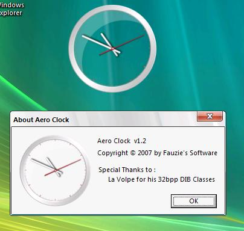



## Aero Analog Clock \(Updated 12 Jan 08\)

### Description

An Analog Clock with per-pixel transparency. It's very beautiful.

For Win2K above only.
 
### More Info
 

             |
---                |---
**Submitted On**   |2008-01-10 09:58:32
**By**             |[Fauzie](https://github.com/Planet-Source-Code/PSCIndex/blob/master/ByAuthor/fauzie.md)
**Level**          |Advanced
**User Rating**    |4.8 (95 globes from 20 users)
**Compatibility**  |VB 6\.0
**Category**       |[Complete Applications](https://github.com/Planet-Source-Code/PSCIndex/blob/master/ByCategory/complete-applications__1-27.md)
**World**          |[Visual Basic](https://github.com/Planet-Source-Code/PSCIndex/blob/master/ByWorld/visual-basic.md)
**Archive File**   |[Aero\_Analo2097061112008\.zip](https://github.com/Planet-Source-Code/fauzie-aero-analog-clock-updated-12-jan-08__1-69842/archive/master.zip)

